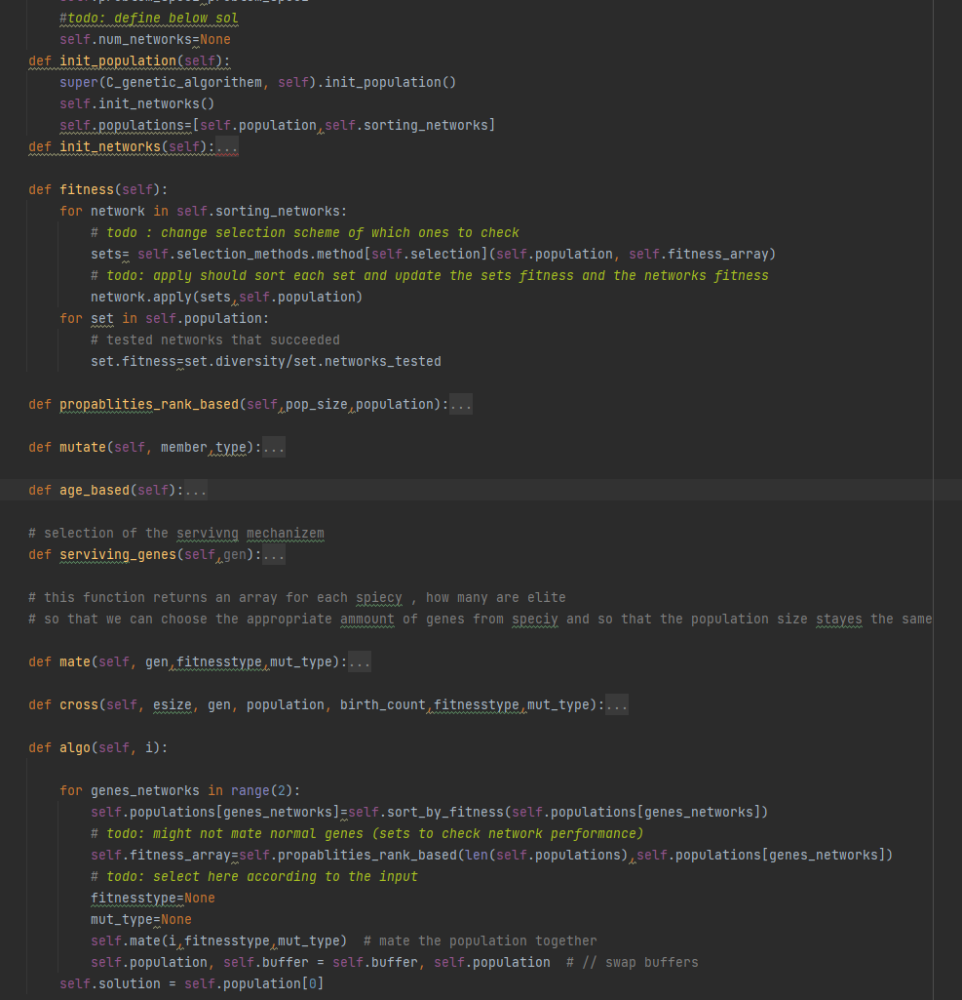

# AI_lab4_coEvoW_networks
 coevolution wih sorting algorithm praperties to find the lowest number of comparitors 
firstly we updated the genetic algorithm to support 2 spicies 

* it now works on both the networks and the solutions and evaluates them based on a selected few of the population
* (any selection method works for both)
* each function in the genetic algo works on both spiecies

created two classes :

        class Sorting(DNA):
            def __init__(self):
                super(Sorting, self).__init__()
        
            def create_object(self, target_size, target):
                self.object = random.sample([i for i in range(1, target_size + 1)], target_size)

* Network class has a creation function to create an initial network 
* a function that orders an unordered set using the network
* a function to check validity of solution
* apply: gets a set of unordered sets and uses the above functions to get a fitness value for it and updates a diversity field in each set 
* diversity of each set depects the number of networks that succeded in ordering it 
* we use this value in the CGA above to calculate fitness for each set of the popilation 

        class network(DNA):
            def __init__(self):
            def create_object(self, target_size, target):
            def character_creation(self, target_size):
            def solve_network(self, set, pop):
            def check_solution(self, set):
            def apply(self, sets, pop):
            def __str__(self):

